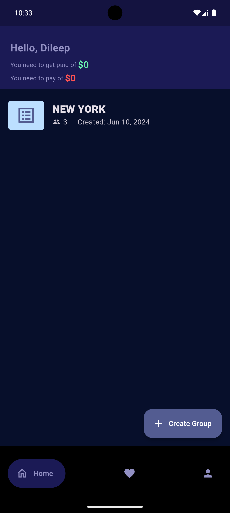
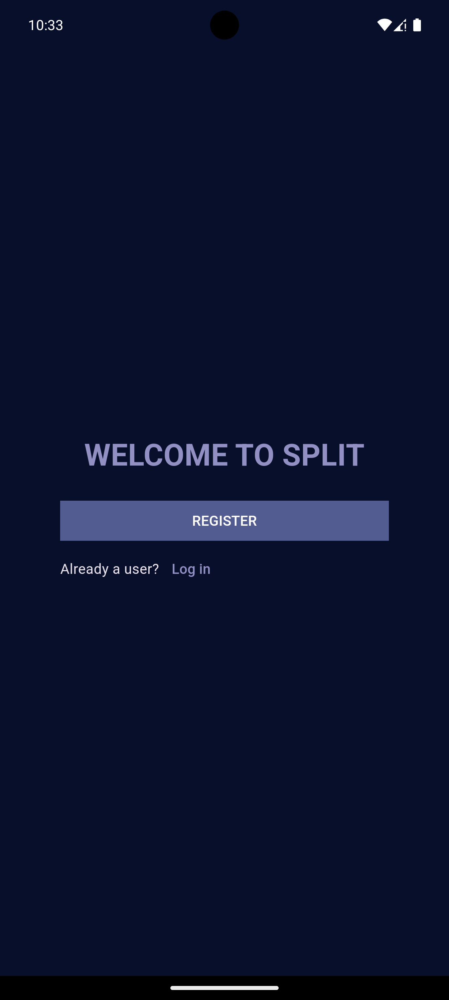
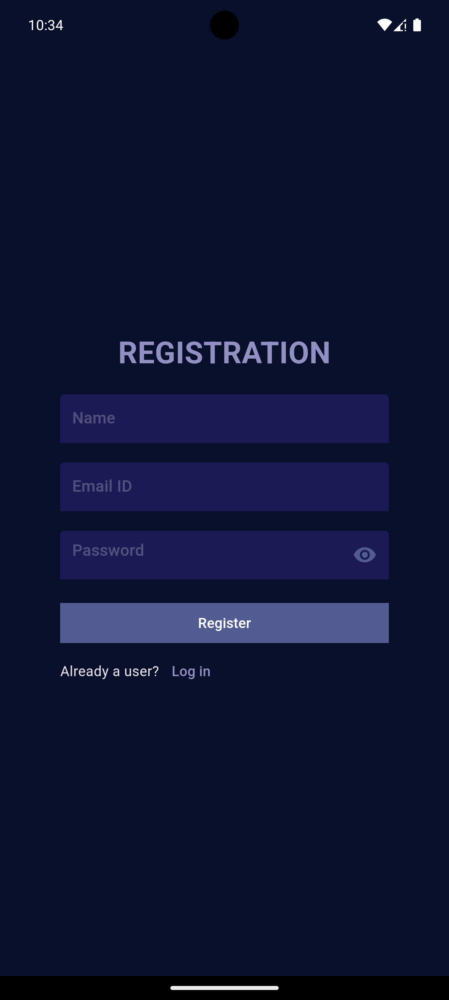

# Splitwise Flutter Application

## Overview

This is a full-stack mobile application built using Flutter, designed to help users split expenses among friends efficiently. The application leverages Firebase as the backend to handle authentication, authorization, and data storage. It employs advanced state management techniques and integrates a minimum cost split algorithm to determine the optimal way to divide expenses. The app is compatible with both iOS and Android platforms and includes push notification capabilities.

## Features

- **User Authentication & Authorization**: Secure user authentication and authorization using Firebase Authentication. Users can sign up, log in, and manage their accounts with ease.
- **Expense Tracking**: Users can add, view, and manage expenses within groups, making it easier to split costs among friends.
- **Minimum Cost Split Algorithm**: A custom algorithm is implemented to calculate the most efficient way to split expenses, minimizing the number of transactions required.
- **Real-time Database**: Expenses, user details, and group data are stored in Firebase Cloud Firestore, ensuring real-time updates and synchronization across devices.
- **State Management**: The application uses the `provider` package for state management, ensuring smooth and scalable management of application state.
- **Cross-Platform Compatibility**: The app is designed to work seamlessly on both iOS and Android devices.
- **Push Notifications**: Integrated Firebase Cloud Messaging to send notifications for updates, reminders, and other important events within the app.
- **Customizable UI**: The application uses the `google_nav_bar` and other UI components for a clean and intuitive user experience.

## Dependencies

The application relies on several Flutter packages and Firebase services:

- **[cupertino_icons: ^1.0.6](https://pub.dev/packages/cupertino_icons)**: Provides iOS-style icons for the application.
- **[firebase_core: ^2.32.0](https://pub.dev/packages/firebase_core)**: A core package for connecting the Flutter application to Firebase.
- **[firebase_auth: ^4.20.0](https://pub.dev/packages/firebase_auth)**: Handles user authentication, including email/password and third-party authentication providers.
- **[cloud_firestore: ^4.17.5](https://pub.dev/packages/cloud_firestore)**: Provides access to Firestore, a NoSQL cloud database, for storing and syncing app data.
- **[flutter_spinkit: ^5.2.1](https://pub.dev/packages/flutter_spinkit)**: A collection of loading indicators to enhance the user experience while waiting for data processing.
- **[provider: ^6.1.2](https://pub.dev/packages/provider)**: A popular state management library for managing app state efficiently.
- **[google_nav_bar: ^5.0.6](https://pub.dev/packages/google_nav_bar)**: A customizable navigation bar widget for an enhanced user interface.
- **[firebase_messaging: ^14.9.4](https://pub.dev/packages/firebase_messaging)**: Enables push notifications using Firebase Cloud Messaging.
- **[intl: ^0.19.0](https://pub.dev/packages/intl)**: Provides internationalization and localization utilities, essential for handling currency, dates, and other locale-specific data.

# Usage

1. User Registration & Login:

   - Users can sign up using their email and password.
   - After registration, users can log in and start creating groups and adding expenses.

2. Create Groups & Add Expenses:

   - Users can create groups, add friends, and start tracking shared expenses.
   - The app will automatically calculate the best way to split expenses using the minimum cost split algorithm.

3. Notifications:
   - Users will receive push notifications for updates, reminders, and any new expenses added within their groups.

## Architecture

The application follows a layered architecture pattern:

- **Presentation Layer:** Handles the UI using Flutter widgets, powered by state management via the provider package.
- **Business Logic Layer:** Manages the minimum cost split algorithm and other business logic.
- **Data Layer:** Handles data interaction with Firebase services such as Authentication, Firestore, and Cloud Messaging.

## Minimum Cost Split Algorithm

The application uses a custom algorithm to minimize the number of transactions required to settle the debts among friends. This algorithm calculates the optimal way to split costs, reducing the complexity and number of transactions, ensuring that each user pays the least possible amount to settle the debts.

## Firebase Integration

- **Authentication:** The app uses Firebase Authentication for secure sign-in and user management.
- **Firestore:** All user, group, and expense data are stored in Firebase Cloud Firestore, ensuring real-time synchronization across devices.
- **Cloud Messaging:** Push notifications are handled through Firebase Cloud Messaging, keeping users informed of any updates or changes.

## Screenshots

Here are some screenshots of the application:

  
  
  

